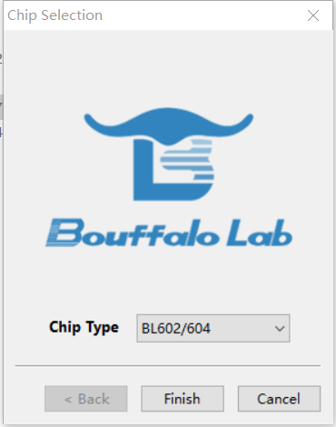

title:博流XT-BL12接入机智云方案及问题排查指引
---

# 修订历史

| 版本 | 修订内容 | 修订人 |  修订日期  |
| :--: | :------: | :----: | :--------: |
| V1.0 |   起稿   |  严树德  | 2022/04/25 |

# 1.本文编写背景

本文主要介绍博流XT-BL12快速从零开始接入机智云，实现简单的透传功能，以及常见的配网失败问题排查，还提供了该模组的相关资料。

# 2. XT-BL12模组资料下载及获取

XT-BL12模组资料下载 ====>https://pan.baidu.com/s/1rp4sas34MGsMj33cgjT8RQ?pwd=gizw

# 3. XT-BL12外围设计原理图

请下载第2章内容，下载模组规格说明书与模组参考设计，使用说明书内推荐的外围设计原理图。

# 4. XT-BL12串口烧写固件说明

## 4.1 XT-BL12固件获取与确认

当拿到一片XT-BL12模块的时候，若确认固件未烧写，请联系商务同事或FAE同事获取。拿到之后解压固件压缩包。

解压之后会发现有1个文件“combine_GAgent_00BL602L_04030001_20220421173843.bin“。（备注：本文固件名称以00BL602L_04030001版本固件为例，其他版本的模组固件名称的软硬件版本名字会有差异。）

## 4.2 XT-BL12硬件设备连接

查看XT-BL12模块的规格说明书，按照说明书内的管脚图与管脚定义，注意EN使能脚需要输入高电平，IO8在下载固件的时候需要输入高电平。

| 管脚名称 |                     管脚描述                     |        管脚状态        |
| :------: | :----------------------------------------------: | :--------------------: |
|    EN    |                   模组使能引脚                   |          悬空          |
|   3V3    |                   模组电源引脚                   |        3.3V供电        |
|   IO8    | UART下载模式：上拉 FLASH启动模式：下拉       |                        |
|   GND    |                       GND                        |                        |
|   RXD   |                   串口接收端                    | 与MCU或串口工具TXD相连 |
|   TXD   |                   串口发送端                    | 与MCU或串口工具RXD相连 |

## 4.3 XT-BL12烧写说明

**XT-BL12烧写方式，直接烧写合并固件。**

准备好串口工具之后，解压章节2下载的压缩包，解压烧录工具文件夹中的压缩包，双击“BLDevCube.exe”文件，CHipType选择“BL602/604”。

- **固件烧写：按照下图的选项,选择对应的Interface选项，选择好串口与波特率1000000，勾选Enable, 填写对应的地址0x0，选中带有combine字眼的bin文件，点击Create&Download,详细看下图**。

重启/复位模组（注意：下载固件IO8必须拉高，下载完后，正常启动模组IO8需要拉低或者悬空），
点击Create&Download后，进度条开始运行，等待一段时间，显示完成便是成功。

# 5.XT-BL12模组日志抓取

## 5.1 XT-BL12模组日志接线方法

5.1.1. 按照下图XT-BL12的管脚定义图，将图中所示的IO3引脚（芯片调试日志信息输出口）连接USB转TTL工具的RXD上，且USB转TTL工具的GND需接模组的GND，然后将USB转TTL工具连接到电脑，使用普通的串口调试助手或者使用机智云的log工具。
5.1.2. 机智云串口打印软件工具下载 https://eyun.baidu.com/s/3oAbSruq 密码：pPsL
5.1.3. 下载解压之后，选择对应的端口和2000000bps，点击打开串口，右侧有日志显示则为正常。

# 6.搭配gokit接入机智云（包含创建数据点，下载代码，demoAPP配网绑定及控制设备等等）

快速接入文档参考链接：http://docs.gizwits.com/zh-cn/deviceDev/debug/WIF_Project.html

> 备注：模组的RXD与TXD为与Gokit通讯的通讯串口，通讯波特率为9600bps，具体可参考文章5.1的模组接线方法图。

